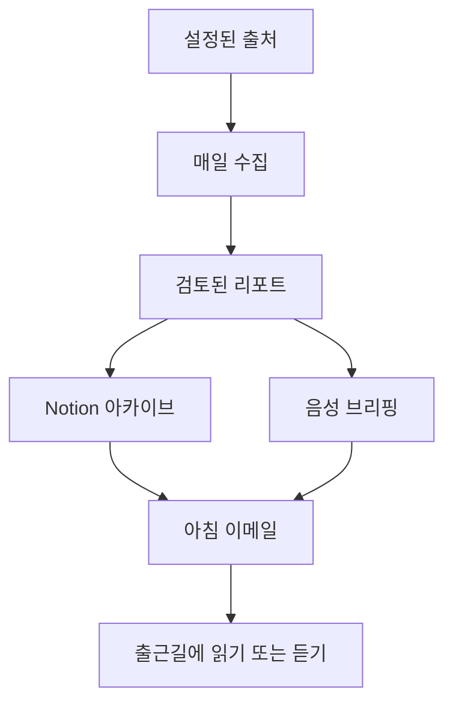
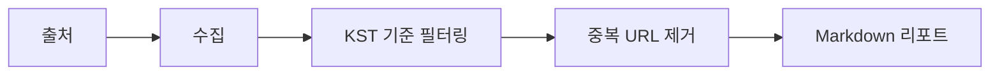

# AI Trend Agent

AI Trend Agent는 AI와 백엔드 기술 변화를 매일 수집하고, 검증한 뒤, 출근 전에 읽거나 들을 수 있는 리포트로 전달하기 위한 개인용 기술 트렌드 에이전트입니다.

현재 상태: 기획 및 Task 001 준비 단계입니다. 아직 실행 가능한 구현 코드는 없습니다.

## 목적

AI와 백엔드 생태계는 매일 빠르게 바뀝니다.

모델 이름, 제품 사용량 제한, 요금제, API 동작, 프레임워크 릴리즈, 클라우드 업데이트가 공식 블로그, 릴리즈 노트, GitHub, 소셜 채널, 영상에 흩어져 있습니다.

이 프로젝트의 목적은 흩어진 정보를 매일 자동으로 모으고, 출처 기반으로 검증한 뒤, 아침 출근 시간에 읽거나 들을 수 있는 브리핑으로 만드는 것입니다.

## 추구하는 방향

이 프로젝트는 `local-first`, `verification-first` 방식으로 개발합니다.

- 먼저 로컬에서 결정적인 수집/필터링/리포트 생성을 완성합니다.
- 날짜, URL, 중복, 출처 메타데이터는 코드로 검증합니다.
- LLM은 요약, 맥락 검토, 실무 영향도 분석에 사용할 예정입니다.
- 중요한 정보는 Notion에 아카이브할 예정입니다.
- 출근 중 들을 수 있는 음성 브리핑을 생성할 예정입니다.
- 최종 리포트는 이메일로 전달할 예정입니다.
- 안정화된 뒤 GCP에서 `Asia/Seoul` 기준으로 매일 자동 실행할 예정입니다.

## 기대 효과

- 매일 여러 출처를 직접 확인하는 시간을 줄입니다.
- AI, 백엔드, 클라우드 변화에 더 빠르게 반응할 수 있습니다.
- 출처 기반 검증으로 오래됐거나 틀린 정보를 받을 위험을 줄입니다.
- Notion에 일별 리포트를 쌓아 나중에 다시 찾을 수 있습니다.
- 출근 시간에 읽거나 들을 수 있는 형태로 정보를 소비할 수 있습니다.
- 이후 소셜, 영상, 전문가 계정까지 확장할 수 있는 반복 가능한 흐름을 만듭니다.

## 장기 흐름



## 현재 범위

첫 번째 구현 대상은 다음 작업입니다.

```text
001_local_collect_markdown_report
```

Task 001은 LLM이나 외부 전달 없이, 로컬에서 결정적으로 검증 가능한 수집 리포트만 만듭니다.

포함 범위:

- 공식 출처 3-5개 수집
- Source Registry 로딩
- RSS, Atom, HTML, GitHub Releases 중 최소 2개 파서 타입 지원
- 로컬 raw cache
- KST 날짜 윈도우 필터링
- canonical URL 중복 제거
- 부분 실패 처리
- Markdown 리포트 생성

제외 범위:

- LLM 호출
- Claude/OpenAI/Gemini 리뷰
- Notion 저장
- TTS 생성
- 이메일 발송
- GCP 배포
- X/Twitter, Threads, YouTube 수집
- 의미 기반 또는 주제 기반 중복 제거

## Task 001 흐름



## 시간 기준

모든 운영 시간 계산은 한국 시간 기준입니다.

- Timezone: `Asia/Seoul`
- 목표 발송 시각: `07:00 KST`
- 수집 시작: 전날 `07:00 KST`
- 수집 종료: 당일 `06:50 KST`
- 가공 버퍼: 10분

예시:

```text
2026-07-19T07:00:00+09:00 <= effectivePublishedAt < 2026-07-20T06:50:00+09:00
```

향후 GCP 배포 시 Cloud Scheduler도 반드시 `Asia/Seoul` 기준으로 설정합니다.

## 기술 선택

Task 001은 다음 기술로 시작합니다.

- Runtime: Node.js
- Language: TypeScript
- Package manager: npm

선택 이유:

- RSS, Atom, HTML 파싱과 CLI 자동화에 필요한 npm 생태계가 충분합니다.
- `Source`, `Article`, `Report` 같은 JSON 중심 스키마를 TypeScript로 관리하기 좋습니다.
- 로컬 CLI에서 Cloud Run 배포까지 같은 언어로 이어갈 수 있습니다.
- 이후 Notion, 이메일, TTS, OpenAI, Anthropic, Google API 연동도 자연스럽게 확장할 수 있습니다.

자세한 결정 배경은 [docs/architecture.md](docs/architecture.md)를 참고합니다.

## 개발 로드맵

1. 로컬 수집 Markdown 리포트
2. 로컬 LLM 요약 및 다중 LLM 리뷰
3. Notion 리포트 아카이브
4. 음성 스크립트 및 TTS 브리핑
5. 이메일 발송
6. GCP 배포
7. 소셜 및 YouTube 확장

자세한 개발 순서는 [docs/development-plan.md](docs/development-plan.md)를 참고합니다.

## Task 001 문서

- [requirements.md](docs/task/001_local_collect_markdown_report/requirements.md)
- [plan.md](docs/task/001_local_collect_markdown_report/plan.md)
- [validation_report.md](docs/task/001_local_collect_markdown_report/validation_report.md)

Task 001 구현 후 사용할 예정인 명령어:

```bash
npm run generate -- --date=2026-07-20
npm run generate -- --date=2026-07-20 --force-refresh
npm run generate -- --source=google-blog-feed --date=2026-07-20
npm test
```

## 주요 문서

- [Requirements](docs/requirements.md)
- [Architecture](docs/architecture.md)
- [Development Plan](docs/development-plan.md)
- [Source Registry](docs/source-registry.md)
- [Data Schema](docs/data-schema.md)
- [Operations](docs/operations.md)
- [Acceptance Criteria](docs/acceptance-criteria.md)

## PR 정책

초기 기획 문서는 `main` 브랜치에 직접 push했습니다.

Task 001부터는 기능 브랜치를 만들고 PR로 리뷰하는 흐름을 사용합니다.

PR 작성 기준:

- [docs/pr-template.md](docs/pr-template.md)
- [.github/PULL_REQUEST_TEMPLATE.md](.github/PULL_REQUEST_TEMPLATE.md)
