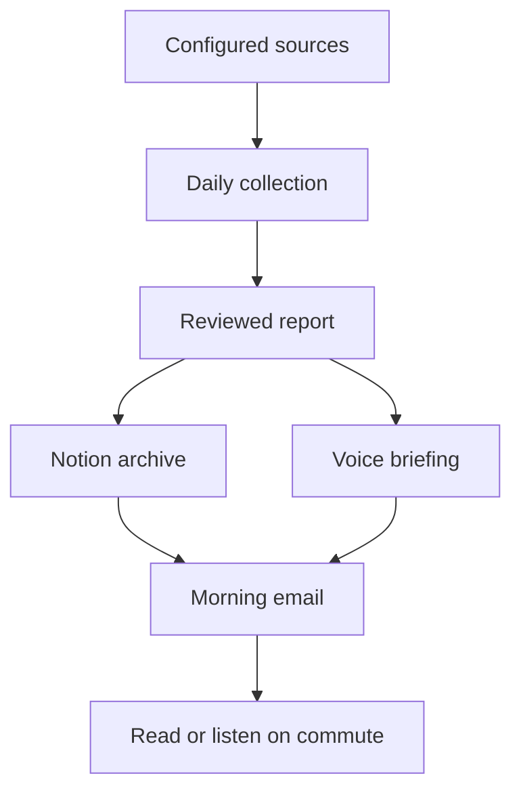
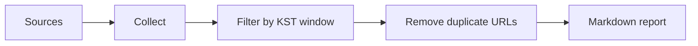

# AI Trend Agent

AI Trend Agent is a planned personal technology intelligence agent for collecting, verifying, and delivering daily AI/backend trend updates.

The goal is simple: stop checking scattered sources every morning and eventually receive a verified digest before commute time.

Status: planning and Task 001 preparation. There is no runnable implementation yet.

## Purpose

AI and backend ecosystems change too quickly to track manually every day.

Model names, product limits, pricing policies, API behavior, framework releases, and cloud updates can change across official blogs, release notes, GitHub, social channels, and videos.

This project aims to turn that scattered information into a daily, source-backed briefing that can be read or listened to during the morning commute.

## Direction

The project follows a local-first, verification-first approach.

- Start with deterministic local collection before adding external delivery.
- Verify dates, URLs, duplicate links, and source metadata with code.
- Use LLMs for summarization, context review, and practical impact analysis.
- Archive useful information in Notion.
- Generate a voice-friendly briefing for commute listening.
- Deliver the final digest by email.
- Deploy the stable workflow on GCP with `Asia/Seoul` scheduling.

## Expected Benefits

- Less time spent checking scattered sources manually.
- Faster awareness of AI, backend, and cloud changes.
- Reduced risk of false or outdated updates through source-based verification.
- A daily archive that can be searched later.
- A commute-friendly format for reading or listening.
- A repeatable workflow for expanding into social and video sources later.

## Long-Term Flow



## Current Scope

The first implementation target is:

```text
001_local_collect_markdown_report
```

Task 001 only covers deterministic local collection.

Included:

- official source collection
- Source Registry loading
- at least two source parser types from RSS, Atom, HTML, and GitHub Releases
- local raw cache
- KST date window filtering
- canonical URL dedupe
- partial failure handling
- Markdown report generation

Excluded:

- LLM calls
- Claude/OpenAI/Gemini review
- Notion
- TTS
- email delivery
- GCP deployment
- X/Twitter, Threads, YouTube collection
- semantic or topic-based dedupe

## Task 001 Flow



## Time Window

All operational time calculations are based on Korean time.

- Timezone: `Asia/Seoul`
- Target delivery time: `07:00 KST`
- Collection window start: previous day `07:00 KST`
- Collection window end: current day `06:50 KST`
- Processing buffer: 10 minutes

Example:

```text
2026-07-19T07:00:00+09:00 <= effectivePublishedAt < 2026-07-20T06:50:00+09:00
```

GCP Cloud Scheduler must also use `Asia/Seoul`.

## Technology Choice

Task 001 uses:

- Runtime: Node.js
- Language: TypeScript
- Package manager: npm

Why:

- strong npm ecosystem for RSS/Atom/HTML parsing and CLI automation
- good fit for JSON-heavy schemas such as `Source`, `Article`, and `Report`
- practical path from local CLI to Cloud Run
- straightforward integration with Notion, email, TTS, OpenAI, Anthropic, and Google APIs later

See [docs/architecture.md](docs/architecture.md) for the language/runtime decision.

## Planned Development Roadmap

1. Local collection Markdown report
2. Local LLM summary and multi-LLM review
3. Notion report archive
4. Voice script and TTS briefing
5. Email delivery
6. GCP deployment
7. Social and YouTube expansion

See [docs/development-plan.md](docs/development-plan.md).

## Task 001 Documents

Task 001 documents:

- [requirements.md](docs/task/001_local_collect_markdown_report/requirements.md)
- [plan.md](docs/task/001_local_collect_markdown_report/plan.md)
- [validation_report.md](docs/task/001_local_collect_markdown_report/validation_report.md)

Planned commands after Task 001 implementation:

```bash
npm run generate -- --date=2026-07-20
npm run generate -- --date=2026-07-20 --force-refresh
npm run generate -- --source=google-blog-feed --date=2026-07-20
npm test
```

## More Documentation

Core docs:

- [Requirements](docs/requirements.md)
- [Architecture](docs/architecture.md)
- [Development Plan](docs/development-plan.md)
- [Source Registry](docs/source-registry.md)
- [Data Schema](docs/data-schema.md)
- [Operations](docs/operations.md)
- [Acceptance Criteria](docs/acceptance-criteria.md)

## PR Policy

Future feature work should use a branch and PR.

PRs should follow:

- [docs/pr-template.md](docs/pr-template.md)
- [.github/PULL_REQUEST_TEMPLATE.md](.github/PULL_REQUEST_TEMPLATE.md)

Initial repository planning docs were pushed directly to `main`. Task 001 and later work should use feature branches.
