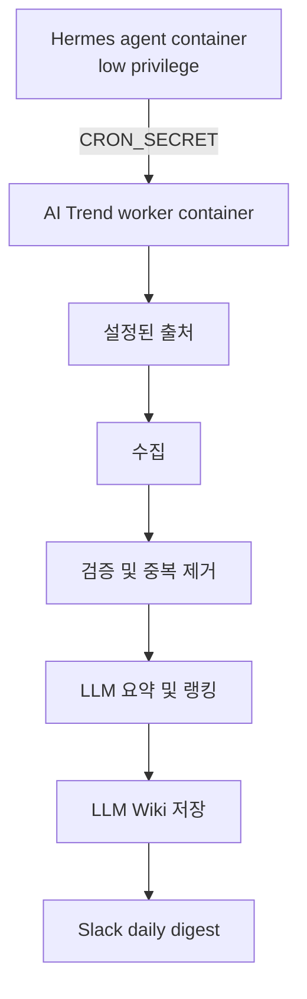
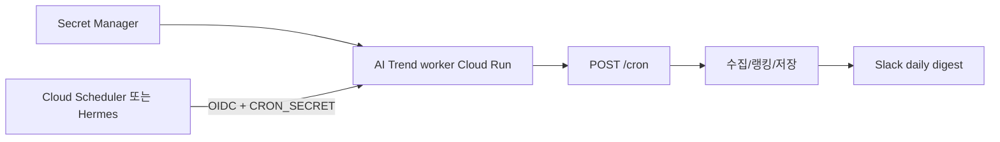

# AI Trend Agent

AI Trend Agent는 빠르게 변하는 AI 트렌드를 사용자가 직접 계속 검색하지 않아도 되도록, 신뢰 가능한 출처와 빠른 신호 채널을 자동 수집하고, LLM Wiki에 저장한 뒤, Hermes agent가 핵심 변화만 선별해 Slack으로 알려주는 개인용 AI 트렌드 에이전트입니다.

현재 상태: v2 Task 006 `GCP 배포` 산출물 구현과 로컬/Docker 검증이 완료된 상태입니다. 실제 GCP 배포는 프로젝트 id, region, Slack webhook, cron secret, 첫 invoker 선택을 확인한 뒤 실행합니다.

## 목적

AI 모델, 에이전트, 개발 도구, 논문, 오픈소스, 제품 정책, API 변경은 매일 빠르게 바뀝니다.

중요한 변화는 공식 블로그, 릴리즈 노트, 문서, GitHub, arXiv, X/Twitter, Threads, Reddit, Hacker News 같은 여러 채널에 흩어져 있습니다.

이 프로젝트의 목적은 흩어진 AI 트렌드 신호를 자동으로 모으고, 출처 기반으로 검증한 뒤, 매일 아침 Slack에서 핵심 변화만 빠르게 확인할 수 있게 만드는 것입니다.

## 추구하는 방향

이 프로젝트는 `local-first`, `verification-first` 방식으로 개발합니다.

- 먼저 로컬에서 LLM Wiki 저장, 수집, 요약, Slack 발송 흐름을 검증합니다.
- 날짜, URL, 중복, 출처 메타데이터는 코드로 검증합니다.
- LLM은 요약, 맥락 검토, 실무 영향도 분석에 사용합니다.
- LLM Wiki를 중심 저장소로 사용합니다.
- Hermes agent의 `/cron` 기능으로 정기 실행합니다.
- MVP의 1차 전달 채널은 Slack입니다.
- 안정화된 뒤 GCP에서 `Asia/Seoul` 기준으로 매일 자동 실행합니다.
- Backend, Frontend, DevOps는 MVP 이후 확장 도메인으로 둡니다.

## 기대 효과

- 매일 여러 출처를 직접 확인하는 시간을 줄입니다.
- AI 트렌드 변화에 더 빠르게 반응할 수 있습니다.
- 출처 기반 검증으로 오래됐거나 틀린 정보를 받을 위험을 줄입니다.
- LLM Wiki에 TrendItem과 Digest를 쌓아 나중에 다시 찾을 수 있습니다.
- Slack에서 매일 핵심 변화만 빠르게 확인할 수 있습니다.
- 이후 백엔드, 프론트엔드, DevOps, 소셜, 영상 채널까지 확장할 수 있는 반복 가능한 흐름을 만듭니다.

## 장기 흐름


```mermaid
flowchart TD
  A[Hermes agent container<br/>low privilege] -->|CRON_SECRET| B[AI Trend worker container]
  B --> C[설정된 출처]
  C --> D[수집]
  D --> E[검증 및 중복 제거]
  E --> F[LLM 요약 및 랭킹]
  F --> G[LLM Wiki 저장]
  G --> H[Slack daily digest]
```

Hermes agent는 Docker 또는 Cloud Run으로 격리하고, 학습/판단/정책 개선을 담당합니다. Slack webhook, DB write 권한, Secret Manager 접근 같은 강한 권한은 AI Trend worker 쪽에만 둡니다.

## 현재 범위

v2 기준 현재 완료된 구현 범위는 다음 작업입니다.

```text
001_llm_wiki_local_store
002_ai_official_source_ingestion
003_trenditem_ranking
004_slack_manual_delivery
005_hermes_cron
006_gcp_deployment
```

v2 Task 006은 Task 005 Hermes cron worker를 Cloud Run에 배포할 수 있도록 production build, Docker image, Secret Manager, Cloud Run, Scheduler, smoke validation 산출물을 만듭니다.

포함 범위:

- production build
- Cloud Run worker Dockerfile
- Secret Manager setup script
- Cloud Run deployment script
- Cloud Scheduler invocation script
- deployment smoke script
- Worker/Hermes 권한 분리 문서

제외 범위:

- 실제 secret 값 입력
- 사용자 GCP project로 실배포
- Cloud SQL/Firestore 전환
- Cloud Storage raw snapshot 전환
- Notion 저장
- TTS 생성
- 이메일 발송

## v2 Task 006 흐름


```mermaid
flowchart LR
  A[Secret Manager] --> B[AI Trend worker Cloud Run]
  C[Cloud Scheduler 또는 Hermes] -->|OIDC + CRON_SECRET| B
  B --> D[POST /cron]
  D --> E[수집/랭킹/저장]
  E --> F[Slack daily digest]
```

## 시간 기준

모든 운영 시간 계산은 한국 시간 기준입니다.

- Timezone: `Asia/Seoul`
- Slack daily digest 목표 시각: `07:00 KST`
- 수집 시작: 전날 `07:00 KST`
- 수집 종료: 당일 `06:50 KST`
- 가공 버퍼: 10분

예시:

```text
2026-07-19T07:00:00+09:00 <= effectivePublishedAt < 2026-07-20T06:50:00+09:00
```

향후 GCP 배포와 Hermes `/cron` 설정도 반드시 `Asia/Seoul` 기준으로 맞춥니다.

## 기술 선택

MVP는 다음 기술로 시작합니다.

- Runtime: Node.js
- Language: TypeScript
- Package manager: npm

선택 이유:

- RSS, Atom, HTML 파싱과 CLI 자동화에 필요한 npm 생태계가 충분합니다.
- `TrendItem`, `Digest`, `SourceEvidence` 같은 JSON 중심 스키마를 TypeScript로 관리하기 좋습니다.
- 로컬 CLI에서 Cloud Run 배포까지 같은 언어로 이어갈 수 있습니다.
- 이후 Slack, OpenAI, Anthropic, Google API, GCP 연동도 자연스럽게 확장할 수 있습니다.

기존 기술 선택 배경은 [docs/architecture.md](docs/architecture.md)를 참고합니다. 이 문서는 v1 기준 내용이 포함되어 있어, v2 아키텍처 확정 전까지 참고 문서로 사용합니다.

## 개발 로드맵

v2 개발 순서:

1. LLM Wiki 로컬 저장소
2. AI 공식 출처 수집
3. TrendItem 생성과 랭킹
4. Slack 수동 발송
5. Hermes `/cron` 연결
6. GCP 배포
7. 소셜 allow-list 확장
8. Backend, Frontend, DevOps 도메인 확장
9. Slack 피드백과 개인화
10. 웹 뉴스 화면

자세한 개발 순서는 [docs/development-plan-v2-llm-wiki-hermes.md](docs/development-plan-v2-llm-wiki-hermes.md)를 참고합니다.

실제 구현 순서와 task별 세부 실행 순서는 [docs/implementation-sequence-v2.md](docs/implementation-sequence-v2.md)를 참고합니다.

웹 뉴스 화면은 MVP 이후 확장으로 둡니다. Rocket Brief의 뉴스 화면은 후속 UI를 설계할 때 참고할 레퍼런스로 기록합니다.

- Reference: https://rocket-brief.vercel.app/news

## v1 Legacy 문서

v1의 로컬 Markdown 리포트 계획은 보관 문서로 유지합니다. v2 구현에서는 [Development Plan v2](docs/development-plan-v2-llm-wiki-hermes.md)를 우선합니다.

- [Legacy Task 001](docs/archive/v1/001_local_collect_markdown_report/requirements.md)

## 주요 문서

문서 입구:

- [Docs Map](docs/README-docs.md)

현재 v2 기준 문서:

- [Requirements v2 - LLM Wiki and Hermes](docs/requirements-v2-llm-wiki-hermes.md)
- [Development Plan v2 - LLM Wiki, Hermes, Slack](docs/development-plan-v2-llm-wiki-hermes.md)
- [Implementation Sequence v2](docs/implementation-sequence-v2.md)

v2 보조 및 참고 문서:

- [Source Registry](docs/source-registry.md)
- [Data Schema](docs/data-schema.md)
- [Operations](docs/operations.md)
- [Acceptance Criteria](docs/acceptance-criteria.md)
- [Showcase Workflow](docs/showcase-workflow.md)
- [Documentation Workflow](docs/doc-workflow.md)
- [Harness Workflow](docs/harness-workflow.md)
- [Token Workflow](docs/token-workflow.md)
- [PR Workflow](docs/pr-workflow.md)
- [Architecture Reference](docs/architecture.md)

Legacy 또는 대체된 문서:

- [Superseded Slack and LLM Wiki Draft Requirements](docs/archive/drafts/draft-slack-llm-wiki-requirements.md)
- [Legacy Requirements](docs/archive/v1/requirements.md)
- [Legacy Development Plan](docs/archive/v1/development-plan.md)
- [Legacy Review Notes](docs/archive/v1/review-notes.md)

## PR 정책

초기 기획 문서는 `main` 브랜치에 직접 push했습니다.

v2 Task 001 이후 작업은 기능 브랜치를 만들고 PR로 리뷰하는 흐름을 사용합니다.

PR 작성 기준:

- [docs/pr-template.md](docs/pr-template.md)
- [.github/PULL_REQUEST_TEMPLATE.md](.github/PULL_REQUEST_TEMPLATE.md)
